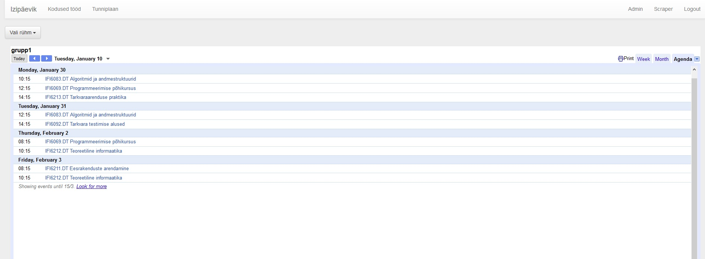

# IziPäevik - http://kool.iziveeb.ee

## Description
    Web application for adding the homework and the curriculum of Tallinn University IFIFB-1 group to Google Calendar.
    The homework is added by selected students.
    The curriculum is taken from Tallinn University ASIO.

## Developers
	Hinrek Saar - developer, hinrek@gmail.com
	Alar Aasa - developer, alar@alaraasa.ee

##To-do:
    * Make scraper less "dumb"

## Technologies used
    * Google API
	* Bootstrap
	* PHP Simple HTML DOM Parser

## Functionality
    * Adding homework to a Google Calendar
    * Getting curriculum data from ASIO
    * Inserting curriculum data to Google Calendar

## 

## Setup       
### --Scraper & addhomework.php
    In scraper folder, run "php composer.phar require google/apiclient" in command line
    In scraper.php & addhomework.php:
        CLIENT_ID =  Client ID from Google API Manager
        REDIRECT_URI = The address where Google will redirect to after a successful log in
        DEVELOPER_KEY = API Key from Google API Manager
        CLIENT_SECRET = Secret key from Google API Manager
        $groupAddress: Specific calendar IDs. In Google Calendar: Calendar settings -> Calendar Address -> Calendar ID

### --MySQL
    1. Create database:
    CREATE DATABASE izipaevik;
    2. Create table:
    CREATE TABLE `izipaevik`.`admins` (
            `id` INT NOT NULL AUTO_INCREMENT ,  
            `email` VARCHAR(255) NOT NULL ,  
            `password` VARCHAR(255) NULL DEFAULT NULL ,  
            `created` TIMESTAMP NOT NULL DEFAULT CURRENT_TIMESTAMP ,  
            PRIMARY KEY (`id`), 
            UNIQUE (`email`) 
    );

### --Config.php
    * Should not be uploaded to Github
    <?php
    
        $serverHost = "your host name";
        $serverUsername = "sql username";
        $serverPassword = "sql password";
    
    ?>
    
## What did we learn?
    * Authentication with Google
    * Using APIs
    * Creating and uploading Google Calendar events
    * Importance of encoding
    