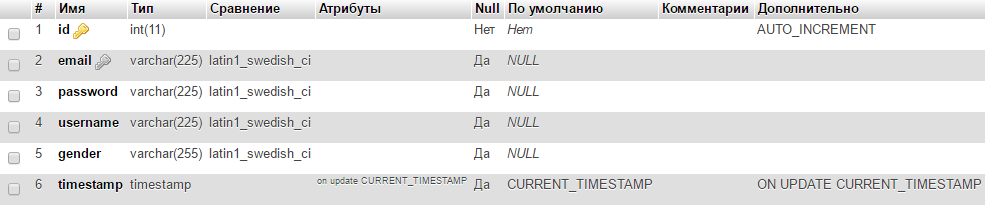
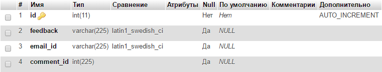
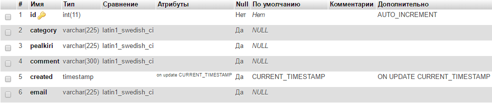

PHP rühmatöö projekt
Nimi: Help desk for new students

Liikmed: Andra Kaljurand, Ksenia Belorusskaja

Eesmärk:
	Luua veebisait, kus need õpilased, kes soovivad Tallinna Ülikooli sisse astuda, leiaksid endale sobiva eriala.
	Nad saavad lugeda foorumist postitusi, samuti lisada sinna postitusi, kui neil on mure või küsimus mingi teatud eriala kohta.
	Veebilehel oleks veel uudisteplokk, kus on informatsioon sisseastumiseksamite kohta.

Veebilehe tabelid:
Tabel grupp_user
</img> 

Tabel grupp_comment
</img> 

Tabel grupp_category
</img> 
