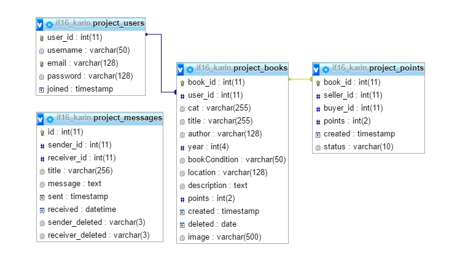

# RAAMATURIIUL


Karin Rikkinen

| Külastaja valikud | Kasutaja valikud |
|----|----|
|| |

## Eesmärk ja kirjeldus
Antud projekti eesmärgiks oli luua keskkond, kus kasutajad saaksid omavahel raamatuid vahetada, tegemist ei ole ostu-müügi keskkonnaga, küll on aga arveldamiseks virtuaalsed mündid. 
Registreerinud kasutaja saab liitumise eest 10 münti. Kasutajad saavad ära anda raamatuid, mida enam ei vajata, ühtlasi saavad valida endale raamatuid teiste kasutajate pakutud raamatute hulgast.
Raamatuid loovutades saab münte, raamatuid saades kulub münte. Iga kasutaja määrab ise, mitu münti(1-10) tema pakutav raamat väärt on.

* Sihtrühm: vanusepiirangut pole
* Sarnased rakendused: http://bookmooch.com/ , http://www.raamatuvahetus.ee/et/ ...mõlemad rakendused on ideeliselt samad, punktide arvestused on erinevad.

## Funktsionaalsuse loetelu
* Konto loomine, sisse logimine
* Raamatute otsimine kategooriate/autori jms põhjal, filtreerimine
* Konkreetse raamatu detailsem vaade
* Raamatute lisamine/muutmine/kustutamine
* Saadud/kulutatud müntide arvestus
* Süsteemisisene kirjavahetus: kirjade saatmine, saabunud ja saadetud kirjade ülevaade 
* Tehingute ülevaade

## Andmebaasi skeem ja tabelite loomise SQL laused


```
CREATE TABLE project_users (
    -> user_id INT NOT NULL AUTO_INCREMENT PRIMARY KEY,
    -> username VARCHAR(50) NOT NULL,
    -> email VARCHAR(128) NOT NULL,
    -> password VARCHAR(128) NOT NULL,
    -> joined TIMESTAMP DEFAULT CURRENT_TIMESTAMP,
    -> UNIQUE(email)
    -> );
	
CREATE TABLE project_books (
    -> book_id INT NOT NULL AUTO_INCREMENT PRIMARY KEY,
    -> cat VARCHAR(255) NOT NULL,
    -> title VARCHAR(255) NOT NULL,
    -> author VARCHAR(128) NOT NULL,
    -> year INT(4),
	-> bookCondition VARCHAR(50) NOT NULL,
	-> location VARCHAR(128) NOT NULL,
	-> description TEXT,
	-> points INT(2),
	-> created TIMESTAMP DEFAULT CURRENT_TIMESTAMP,
	-> deleted DATE DEFAULT NULL
	-> image VARCHAR(500),
	-> user_id INT(11),
	-> FOREIGN KEY (user_id) REFERENCES project_users(user_id)
	-> );
	
CREATE TABLE project_points (
	book_id INT NOT NULL UNIQUE,
	user_id_give INT NOT NULL,
	user_id_get INT,
	points INT(10) NOT NULL,
	created TIMESTAMP DEFAULT CURRENT_TIMESTAMP,
	status VARCHAR(10),
	FOREIGN KEY (book_id) REFERENCES project_books(book_id)
	);
	
CREATE TABLE project_messages(
    id INT NOT NULL AUTO_INCREMENT PRIMARY KEY,
    sender_id INT(11) NOT NULL,
    receiver_id INT(11) NOT NULL,
    title VARCHAR(256),
    message TEXT,
    sent TIMESTAMP DEFAULT CURRENT_TIMESTAMP,
    received DATETIME DEFAULT NULL,
	sender_deleted VARCHAR(3),
	receiver_deleted VARCHAR(3)
    );
```

## Kokkuvõte
Õppisin juurde väga palju. Kuna varem polnud ei php-koodi ega ka sql-käskluseid kirjutanud, samuti polnud kasutanud Bootsrapi, Github'i ega andmebaase, siis uusi oskuseid sain kõvasti. Pean enda jaoks kogu projekti õnnestumiseks. Ebaõnnestumistest tooks välja stiili, antud projektis pidasin tähtsamaks nn köögipoolt, CSS jäi teisejärguliseks, eks seda on ka tulemusest näha. Projekti käigus õppisin, et lisaks koodi kirjutamisele, tuleb harjutada ka koodi lugemist, viimast pean enda nõrgemaks küljeks. 
