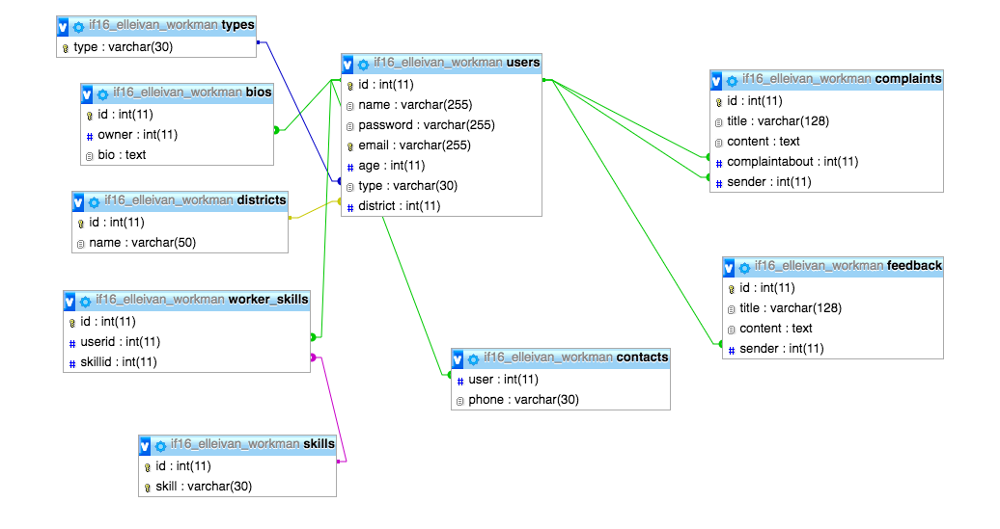

# WORKMEN / FIXIFY


Kristel Roosimaa, Mihkel Põder, Elle Elisa Ivantšikova

## Eesmärk
Antud projekti eesmärgiks on võimaldada inimestel kiirelt ja lihtsalt tellida teenust, mis lahendaks probleeme nagu näiteks umbes torud, elektrikatkestus, koristamata kodu, it mured jne. Anname ka võimaluse töömeestel ja -naistel end igapäevaselt tööturul hoida, teenida kiiret raha ning ise enda tööaega planeerida. Meie veebirakendus võimaldab võrrelda erinevaid tööd pakkuvaid isikuid sealhulgas nende töötasu, teiste kasutajate poolset hinnangut ja võimalikku saabumisaega.

## Kirjeldus
* Sihtrühm:
	* Vanus: 20-75+
	* Sugu: Pole oluline, kuid suurema tõenäosusega kasutaksid rakendust naised
* Eripära(võrreldes teiste samalaadsete rakendustega - kirjelda vähemalt 2-3 sarnast rakendust mida eeskujuks võtta): Taxify rakendus oli meil esialgu inspiratsiooni aluseks, mis pakub inimestele teenust leida takso enda läheduses, võrrelda erinevate taksode hindu ja kaugust ning valida enda jaoks sobilik takso. Meie veebilehe mõte on sarnane, et aidata inimestel leida oskuslike inimesi, kes saaksid aidata erinevate parandustega. On olemas erinevaid veebilehti ja gruppe Facebookis, kus inimesed üksikult pakuvad erinevaid teenuseid, näiteks nagu koristaja.ee või Facebookis Telli Töömees. Eripärana tooks välja, et sellist veebilehte, ei ole me veel leidnud, kus oleks paljud erinevate oskustega inimesed ühes kohas kättesaadaval. 
* Funktsionaalsuse loetelu prioriteedi järjekorras:
	* Sisse logimine ja registreerumine
	* Kasutajate otsimine ja filtreerimine
	* Profiili loomine ja muutmine
	* Kasutajate kontaktide leidmine

## Andmebaasi skeem ja tabelite loomise SQL laused


```
create database workman;
use workman;

create table types (
type varchar(30) unique not null primary key
);

insert into types values ("user"), ("worker"), ("admin");

create table districts (
id int not null unique auto_increment primary key,
name varchar(50)
);
insert into districts(name) values ("Kesklinn"), ("Pirita"), ("Kristiine"), ("Kopli"), ("Kitseküla"), ("Ülemiste"), ("Lasnamäe"), ("Mustamäe"), ("Õismäe"), ("Haabersti"), ("Kalamaja"), ("Põhja-Tallinn"), ("Rocca al Mare"), ("Kadriorg"), ("Tondiraba"), ("Kadaka"), ("Hiiu"), ("Nõmme"), ("Sikupilli"), ("Pae"), ("Seli"), ("Väo"), ("Sadama"), ("Raua"), ("Juhkentali"), ("Uus Maailm"), ("Pelgulinna");

create table skills (
id int not null unique auto_increment primary key,
skill varchar(30) not null unique
);
insert into skills(skill) values ("Torumees"), ("Elektrik"), ("Korstnapühkija"), ("Ehitaja"), ("Koristaja"), ("Klaverihäälestaja");

create table users (
id int unique not null auto_increment primary key,
name varchar(255) not null,
password varchar(255) not null,
email varchar(255) not null unique,
age int,
type varchar(30),
district int,
foreign key (type) references types(type),
foreign key (district) references districts(id)
);

create table worker_skills (
id int unique not null auto_increment primary key,
userid int,
skillid int,
foreign key (userid) references users(id),
foreign key (skillid) references skills(id)
);

create table messages (
id int not null unique auto_increment primary key,
sender int,
recipient int,
content text,
timesent datetime,
timeseen datetime,
foreign key (sender) references users(id),
foreign key (recipient) references users(id)
);

create table complaints (
id int not null unique auto_increment primary key,
title varchar(128),
content text,
complaintabout int,
sender int,
foreign key (complaintabout) references users(id),
foreign key (sender) references users(id)
);

create table feedback (
id int not null unique auto_increment primary key,
title varchar(128),
content text,
sender int,
foreign key (sender) references users(id)
);

create table bios (
  id int not null unique auto_increment primary key,
  owner int,
  bio text,
  foreign key(owner) references users(id)
);
```

* Kokkuvõte: mida õppisid juurde? mis ebaõnnestus? mis oli keeruline?
	* Kristel: Õppisin olema kannatlik, paremini süvenema detailidesse, väga palju lehe kujundamisest ja  seda kui palju aega ja vaeva üks lehekülg võib nõuda.
	Isiklikuks ebaõnnestumiseks pean php tegemises vähest osavõttu. Projekti osas sõnumite süsteem ja mõned väikesed detailid, nagu profiilipildi muutmine jms. Keeruline oligi ebaõnnestunud asjad :) 
	* Mihkel: Õppisin rühmatöös olevaid keerukusi ja detaile. Soov oli luua ka sõnumite süsteem, et kasutajad saaksid omavahel sõnumeid vahetada, kuid sellega otseselt tegeleda ei osanud. Keeruline oli kirjutada koodi kõige uuema PHP versiooni jaoks, ning siis leida, et see ei tööta kooliserveris.
	* Elle: Õppisin väga palju juurde kuidas kasutada CSS-i, samuti ka HTML-i kirjutamist, eriti div-ide kasutamist. Ebaõnnestumise alla tooks välja enda arust vähest minu poolset osa kogu projekti kirjutamises, mida oleks saanud vältida kui oleksime grupina alguses igaühele täpsemad ülesanded/osad ära jaotanud. Samuti pean ebaõnnestumiseks, et saime grupiga liiga harva ühiselt kokku, et koos projekti kallal töödata. Võiksin öelda, et kogu projekt oli küllaltki keeruline, kuna grupis olid erinevate kogemustasemetega inimesed ning oli raske leida ühist vaba aega, et kokku saada. Projekti siseselt oli ühiselt keeruline välja mõelda kasutajate vahelist sõnumite vahendamist.
